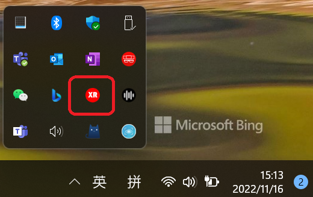

# Lenovo ThinkReality A3 PCAR App Dev

## Overview

Lenovo ThinkReality A3 is an AR glass that could tether to either PC or phone for productivity. 
See [product introduction here](https://www.lenovo.com/us/en/thinkrealitya3). 

With the release of 3.0.xxx, A3 PCAR version supports the openXR industry standard, 
which means you can develop your own XR app and run with the device. 
For app rendering interface, it supports DirectX 11/12 extension on windows. 
Support for 3DOF controller will come soon, currently you can use game controller, like XBox360 to allow user 
interact with you application.

## Quick start 
Lenovo openXR runtime supports various app development environment. All of them are based on OpenXR API.

Here are the respective sample code/project for C++,Unity, and Unreal engine.
1. **C++** Hello_xr is an C++ example to discover, load, and draw some simple geometry. https://github.com/KhronosGroup/OpenXR-SDK-Source/tree/main/src/tests/hello_xr.  
Please follow this [guide](https://github.com/KhronosGroup/OpenXR-SDK-Source/blob/main/BUILDING.md) to build it.
2. **Unity** Please follow the office guidance of Unity https://docs.unity3d.com/Packages/com.unity.xr.openxr@1.5/manual/index.html
   **Note**: 
     &emsp; a) Set interaction profile in Edit-->Project settings-->XR Plug-in management to "Khronos simple 
  controller profile" 
      &emsp; b) Import the controller sample from openXR plugin package, you will get same sample as the prebuilt below
 
3. **Unreal Engine** Please follow the office guidance of Unreal Engine. https://docs.unrealengine.com/5.0/en-US/developing-for-head-mounted-experiences-with-openxr-in-unreal-engine/

Current Lenovo openXR runtime will verify the signature of the above executable, follow step 1 
in section below to import the root certificate.

## Try with the prebuilt binary 
You can try the 3 samples above with prebuilt binary. First download this repository, then do the following:
1. open cmd.exe with administrator priviledge
2. `cd <repdir>\sample_bin_`
3. import the root certificatet
    `.\certmgr.exe /c /add root.spc /s -r localMachine root`  
4. Attach your A3 glass to laptop, and close the automatically started virtual display app in the 
   Lenovo XR Shell. You should pop out the Lenovo XR Shell app by clicking the icon. 

 

5. try the app by clicking the run_xr.bat in each sample app directory. If the root certificate 
failed to install, you will get stuck at startup. Try to fix the certificate issue, and kill 
lxrcompositor process via taskmgr, it will restart automatically

## Prerequisites
- **Device**    Lenovo ThinkReality A3
- **Runtime**   [PCAR Version](https://support.lenovo.com/us/en/downloads/vdm)
- **Development Software** 

   | Software     | Recommended version |
	|--------------|---------------------|
	| Visual studio |   2019 or above    |
	| Unreal Engine |  4.27 or above     |
	| Unity         |  2020 LTS+         |

### Test with your own app ### 
Before your own application can run with Lenovo OpenXR runtime，it should be signed with a system 
 trusted certificate. You should obtain the certificate from known CA. 

For test purpose, you can use the root certificate mentioned in "Try with the prebuilt binary"，Double click the [signcode.exe](./sample_bin/signcode.exe) and follow the wizard. In the step of "Signing Options" should choose the "Custom"; In the step of "Signature Certificate" choose the [root.spc](./sample_bin/root.spc); In the step of "Private Key" choose the [root.pvk](./sample_bin/root.pvk). The password  is "123456" for the [private key](./sample_bin/root.pvk) which named as root.pvk. 
**Notice**: **SHOULD NOT** use the certificate to sign application for publish purpose. 

## Components in PCAR version
- **Lenovo XR Shell** Application manages to allow user start/stop openXR based application. To make your own app appear here, you should use add a register item. Here is an example solution for how to do it  .[2DLauncher_config.zip](./2DLauncher_Config.zip)
- **Lenovo VDM** an openXR based App that manages the multiple virtual screens
- **Lenovo Launcher 3D** An openXR based App which has the similar functions as Lenovo XR Shell

 
